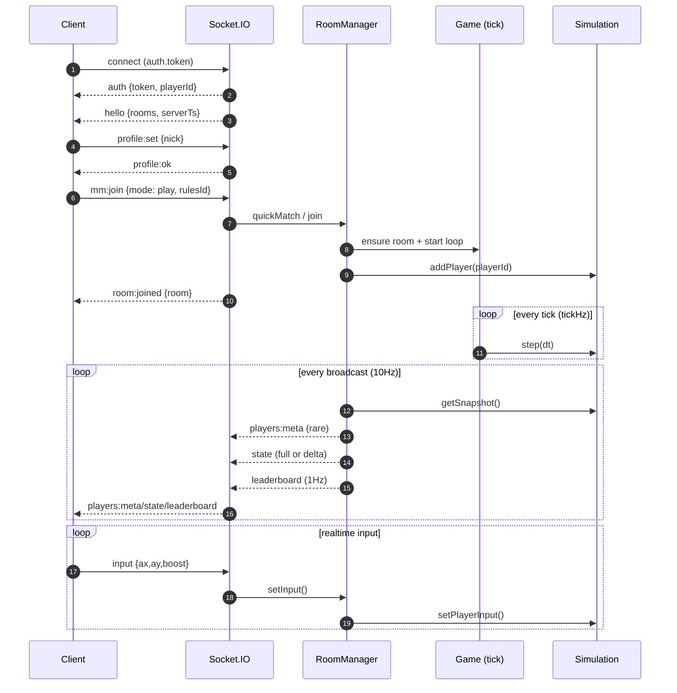
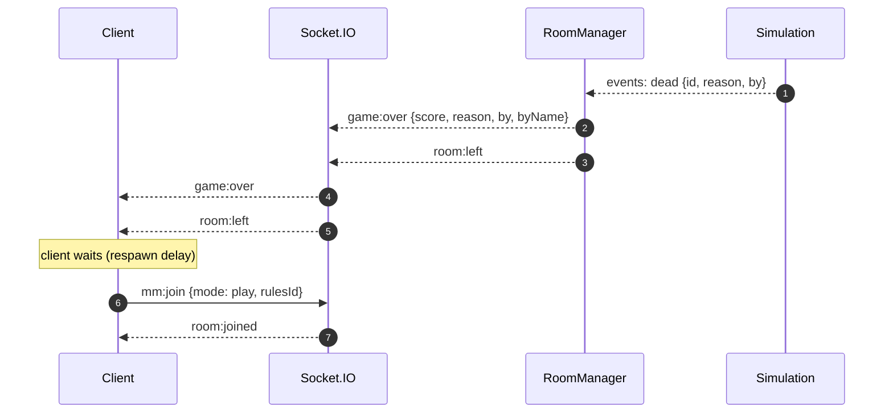

# Data Flow (Current Playable Loop)

This doc describes the **current closed-loop architecture** (P0 playable loop) and how data flows through the system.

## Components

- **Browser Client**: `server/public/client.js` (Canvas2D render, input, HUD/minimap, config merge)
- **Control-plane**: Socket.IO (auth/session, matchmaking, join/leave, input uplink, config tuning)
- **State downlink**:
  - Default: Socket.IO `state` events (delta-compressed)
  - Optional: native WebSocket `/ws` (read-only state stream; `fmt=object|array|bin`)
- **Server runtime**:
  - `server/index.js`: HTTP/Express, Socket.IO, `/ws`, `/healthz`, broadcast logic
  - `server/src/rooms.js`: sessions/rooms, matchmaking, bot lifecycle
  - `server/src/game.js`: per-room tick loop wrapper
  - `server/src/state.js`: authoritative simulation (movement, pellets, PVP, bots AI)
  - `server/src/rules/*`: rulesets selected by `rulesId`
- **Optional scaling**: Redis adapter for Socket.IO (multi-instance)

## High-level flow (overview)

```mermaid
flowchart LR
  subgraph Client[Browser Client]
    UI[Login UI / HUD / Minimap]
    Input[Input Model\n(mouse/touch/keyboard)]
    Render[Canvas2D Render Loop]
    LocalCfg[config.json + URL + localStorage\nmerge]
  end

  subgraph Server[Node.js Server]
    HTTP[Express\n/static + /healthz]
    IO[Socket.IO\n(control-plane)]
    WS[WebSocket /ws\n(state downlink)]
    Rooms[RoomManager\n(rooms/sessions/matchmaking)]
    Game[Game Loop\n(tickHz/broadcastHz)]
    Sim[World Simulation\n(state.js + rules)]
  end

  subgraph Infra[Optional Infra]
    Redis[(Redis\nSocket.IO adapter)]
  end

  UI -->|profile:set, mm:join, room:join/leave| IO
  Input -->|input {ax,ay,boost}| IO

  IO --> Rooms
  Rooms --> Game
  Game --> Sim

  Sim -->|snapshot/events| Rooms
  Rooms -->|players:meta (rare)| IO
  Rooms -->|state (10Hz, delta)| IO
  Rooms -->|leaderboard (1Hz)| IO

  Rooms -->|state stream (optional)| WS

  IO -.->|optional adapter| Redis
  HTTP --> Client
  Client -->|GET /, /config.json| HTTP

  Render <-->|consume snapshots| IO
  Render <-->|consume snapshots| WS
  LocalCfg --> UI
```

## Control-plane vs State-plane

- **Control-plane (Socket.IO)**
  - Auth/session: `auth`, `hello`
  - Matchmaking & room: `mm:join`, `room:join`, `room:leave`, `room:joined`, `room:left`
  - Input uplink: `input`
  - Tuning toggles: `bots:set`, `rules:setConfig`
  - Notifications: `game:over` (death/kick loop)

- **State-plane (downlink)**
  - Socket.IO:
    - `players:meta` (pid mapping + name/color/isBot; sent rarely)
    - `state` (10Hz; delta-compressed; players are slim: pid/x/y/r10/score)
    - `leaderboard` (1Hz; throttled)
  - WebSocket `/ws` (optional):
    - `hello` JSON
    - `players:meta` JSON
    - `state` frames in `object|array|bin`

## Join + play loop (sequence)



## Death + respawn closure

There are two death-related paths in the current architecture:

1. **Simulation-level respawn** (if `deathMode: respawn`)
   - The simulation immediately resets the victim inside the same room (position/radius/score reset).
   - The client stays in-room and continues receiving state.

2. **Kick-style game-over** (if `deathMode: kick`)
   - The simulation marks the player dead.
   - Server sends `game:over`, removes you from the room, then emits `room:left`.
   - Client’s auto-respawn loop waits briefly and calls `mm:join` again to re-enter.



## Notes / implementation details

- The **`state` payload intentionally omits meta fields** (name/color/isBot) to reduce bandwidth.
  - Clients must join `players:meta` (pid → meta) with `state` (pid → position/score).
- Player growth and PVP rules are **server-authoritative** in `server/src/state.js`.
- Optional `/ws` state downlink exists to reduce overhead; Socket.IO remains the control-plane.
