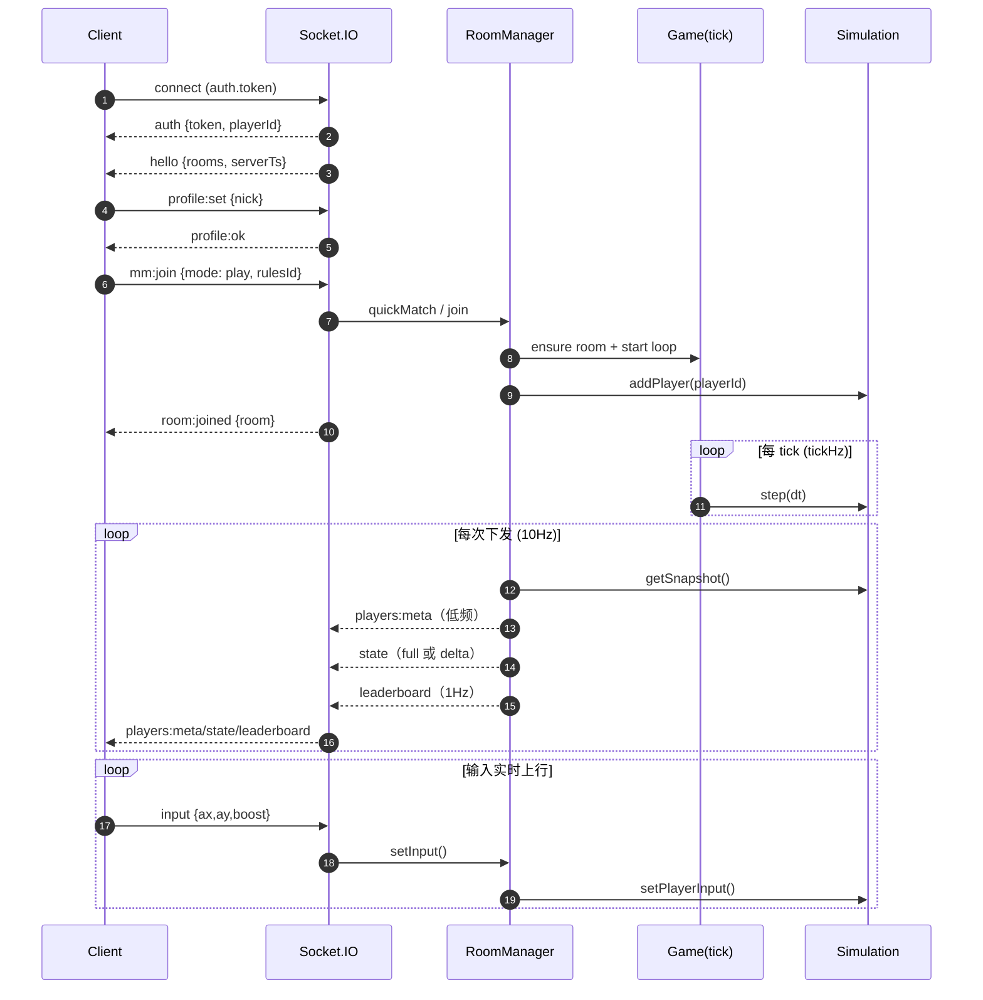
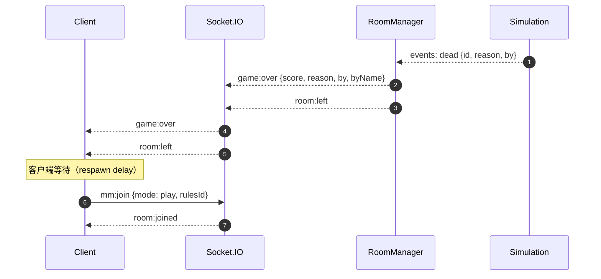

# 数据流转图（当前可玩闭环架构）

本文整理当前 **P0 可玩闭环** 的数据流转：哪些数据走 Socket.IO，哪些走状态下行（Socket.IO 或原生 WS），以及“死亡→重生”闭环如何串起来。

## 组件划分

- **浏览器前端**：`server/public/client.js`（Canvas2D 渲染、输入、HUD/小地图、配置合并）
- **控制通道（Control-plane）**：Socket.IO（认证/会话、匹配、进出房间、输入上行、调参开关）
- **状态下行（State-plane）**：
  - 默认：Socket.IO 的 `state`（10Hz，增量/差量压缩）
  - 可选：原生 WebSocket `/ws`（只读 state stream；`fmt=object|array|bin`）
- **服务端核心**：
  - `server/index.js`：HTTP/Express + Socket.IO + `/ws`，组包/下发
  - `server/src/rooms.js`：sessions/rooms、匹配、Bots 生命周期
  - `server/src/game.js`：房间 tick/broadcast 定时器封装
  - `server/src/state.js`：权威模拟（移动、豆子、PVP 吞噬、Bots AI）
  - `server/src/rules/*`：按 `rulesId` 切换规则
- **可选扩展**：Redis（Socket.IO 多实例 adapter）

## 总览数据流（架构图）

```mermaid
flowchart LR
  subgraph Client[浏览器前端]
    UI[登录界面 / HUD / 小地图]
    Input[输入模型\n(mouse/touch/keyboard)]
    Render[Canvas2D 渲染循环]
    LocalCfg[配置合并\n默认 + config.json + URL + localStorage]
  end

  subgraph Server[Node.js 服务端]
    HTTP[Express\n静态资源 + /healthz]
    IO[Socket.IO\n控制通道]
    WS[WebSocket /ws\n状态下行]
    Rooms[RoomManager\n房间/会话/匹配]
    Game[Game Loop\n(tickHz/broadcastHz)]
    Sim[World Simulation\n(state.js + rules)]
  end

  subgraph Infra[可选基础设施]
    Redis[(Redis\nSocket.IO adapter)]
  end

  UI -->|profile:set, mm:join, room:join/leave| IO
  Input -->|input {ax,ay,boost}| IO

  IO --> Rooms
  Rooms --> Game
  Game --> Sim

  Sim -->|snapshot/events| Rooms
  Rooms -->|players:meta（低频）| IO
  Rooms -->|state（10Hz，delta）| IO
  Rooms -->|leaderboard（1Hz）| IO

  Rooms -->|可选 state stream| WS

  IO -.->|可选 adapter| Redis
  HTTP --> Client
  Client -->|GET /, /config.json| HTTP

  Render <-->|消费快照| IO
  Render <-->|消费快照| WS
  LocalCfg --> UI
```

## 控制通道 vs 状态下行

- **Socket.IO（控制通道）**
  - 认证/会话：`auth`, `hello`
  - 匹配/房间：`mm:join`, `room:join`, `room:leave`, `room:joined`, `room:left`
  - 输入上行：`input`
  - 开关/调参：`bots:set`, `rules:setConfig`
  - 通知：`game:over`（kick-style 死亡/出房）

- **状态下行（下发）**
  - Socket.IO：
    - `players:meta`：pid 映射 + name/color/isBot（低频）
    - `state`：10Hz；玩家字段 slim（pid/x/y/r10/score），并支持 `playersD/playersGone` 的增量
    - `leaderboard`：1Hz（节流）
  - `/ws`（可选）：
    - `hello` JSON
    - `players:meta` JSON
    - `state` `object|array|bin`

## 加入房间与运行循环（时序）



## 死亡 → 重生闭环

当前实现存在两种“死亡处理”路径：

1. **模拟内重生**（`deathMode: respawn`）
   - 模拟直接把受害者 reset（位置/半径/分数），仍在同一房间继续玩。

2. **kick-style game-over**（`deathMode: kick`）
   - 模拟判定死亡后，服务端发 `game:over` 并把你移出房间，然后发 `room:left`。
   - 客户端的自动重生逻辑延迟一小段时间，再调用 `mm:join` 重新进房开始新一局。



## 关键实现要点

- `state` 包为了省带宽，**刻意不带 meta 字段**（name/color/isBot）。
  - 前端必须用 `players:meta`（pid→meta）去 join `state`（pid→位置/分数）。
- 吞噬/成长/PVP 等规则由 `server/src/state.js` **服务端权威**计算。
- `/ws` 的目的是“更省状态下行带宽”；控制与输入仍建议走 Socket.IO。
